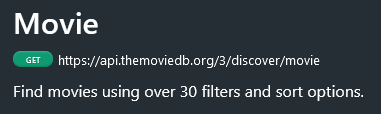

# React 19 Full Course (2025)

JavaScript Mastery: https://www.youtube.com/watch?v=dCLhUialKPQ   
Repo: https://github.com/adrianhajdin/react-movies/blob/main/README.md

Prerequisite: a solid understanding of JavaScript  
Objective: building a movie application  

## Local project setup requires:
- Node.js installed, along with npm
- VS Code
- Git
- run 'npm install' to install all dependencies
- create an .env.local file and paste your TMDB API key next to `VITE_TMDB_API_KEY=`
- then you can run 'npm run dev' to start your local server

---

# What is React?

A JS library created by facebook that powers some of the world's most dynamic UIs (user interfaces).  
Initially, it was only used for front-end development.  

It's maintained by a strong open-source community constantly innovating with new features.  
One of these features is **server components**, they simplify your backend workflow by running React on the server side.  

Of course, React isn't alone. Frameworks like Vue.js, Svelte, Astro or Angular are also making waves.  
But when it comes to popularity, React dominates.  


React is the backbone of key stacks like **MERN** and **PERN**.  
It extends to mobile development with **React Native**.  
And it integrates seamlessly with modern frameworks like **Next.js** for full-stack development.  

With React, you won't see a single page reload or a loading spinner, even when browsing different sections.  
Everything happens dynamically on one page (SPA = single page application).  
To make it possible, React uses JavaScript (JS) and the **Virtual DOM**.  

The virtual DOM is like a simplified map of your webpage, a JS object that mirrors the real DOM.  
When something changes, React creates a new virtual DOM element, then compares it to the old one to pinpoint the difference,  
and only the changed part of the real DOM is updated, making React blazingly fast.

---

# React Setup

## Node & npm

Before creating a React project, you need **Node.js** installed on your machine.  
Node is a JS runtime that allows you to run JS code outside of a browser.  
This is essential because React development involves running tools and scripts on your local machine, and these tools require Node.js.  

When you install Node.js on your machine, you also get a handy tool called **npm** (node package manager).  
In some cases, you might need to install npm separately.  

Instead of writing everything from scratch, you can use npm to quickly add features like animations, form handling,  
or even full frameworks by pulling them from its massive collection of ready-to-use libraries.  
And it also makes it super easy to keep your tools and code up-to-date, ensuring everything works smoothly together.  

In simple terms, npm will save you time and effort by giving you access to a lot of packages to help you build your modern apps more efficiently.

## Pick an IDE

Now that you have Node.js and npm installed, you need a place to write your React code.  
There are many code editors out there, but I prefer **WebStorm**, as it's a fully-fledged IDE (integrated dev environment) designed specifically for React.  
As of recently, WebStorm became completely free for non-commercial use.  
WebStorm offers you everything you need, from a quick project setup, error reporting, an integrated Git system, and more...  

## Git

While it's not mandatory to have Git installed to start learning React, it's absolutely essential for your growth as a developer.  

---

# Create a React project

There are different ways to create a React app, but **Vite** has quickly become a new norm and an industry's favorite.  
Vite offers faster build times, improved performance, and modern tooling.

## What is Vite?

Vite is a modern **frontend** build tool designed to optimize the development and production processes for web applications.  
Created by Evan You in **2020**, the creator of Vue.js, Vite (pronounced "veet", meaning "quick" in French).  

Vite's use of **native ES modules** eliminates bundling during development, significantly reducing startup times.  
Its **HMR** (hot module replacement) feature ensures immediate feedback when editing code.  

For production, Vite uses **Rollup** to bundle and optimize assets, resulting in **smaller bundle** sizes and **faster build** times compared to traditional tools like Webpack.  

While it was initially designed for Vue.js projects, Vite **supports multiple JS frameworks** such as React, Svelte, and others through its **plugin ecosystem**.  

Vite is widely regarded as a next-generation tool for building **fast** and efficient web applications, offering a **superior developer experience** (DX) compared to older tools like Webpack or Parcel.

---

## Create a new React project with Vite

To quickly start a new React project with Vite:
- Open a terminal window within your code editor
- `cd `into the folder where you host your Dev projects
- run `npm create vite@latest`
- name your project (this creates a folder after that name)
- choose the React framework
- choose JavaScript or TypeScript (depending on your needs and TypeScript knowledge)
- `cd` into your freshly created project folder
- run `npm i` to install all the dependencies needed to run your app
- then `npm run dev` if you want to run your starter app (accessible at http://localhost:5173/)

## Starter files & folders

Let's see which files and folders have been generated:
- at the bottom, we have the `vite.config.js` file, which allows you to **customize the build process**, such as adding plugins, 
configuring the server settings, and more.

- the `package.json` file contains the **metadata** of our project, such as its **name**, **scripts**, and **dependencies** needed to run our app.
  - the dev script starts the development server
  - the build script creates a production-ready build of our app.
  - you can run these script by running `npm run dev` or `npm run build` in the terminal.

- the `package-lock.json` file is automatically generated when your run `npm i`. It **locks down the versions of the dependencies** installed in our project, ensuring that every project installation, regardless of its location, uses the same versions.

- the `index.html` file is the **entry point** of our app. It contains the HTML structure of our app, in particular, the `<div>` element with the `id="root"` attribute.
```html
<body>
  <div id="root"></div>
  <script type="module" src="/src/main.jsx"></script>
</body>
```

- the `main.jsx` file is also the **entry point** of our React app. It's where the <App /> component is rendered.
```jsx	
createRoot(document.getElementById('root')).render(
  <StrictMode>
    <App />
  </StrictMode>,
)
```

- the `App.jsx` file is the **parent component** of our app. It contains the **JSX** (JavaScript XML) code that defines the structure of our app.

React will infuse the `<div id="root">` element of our `index.html` file with our entire application, meaning the <App /> component.  
The `App.jsx` file will contain the different components (the **child** components) that we will create later on.  

- The `eslint.config.js` file is used to configure the ESLint (JavaScript Linter) tool.  
  - ESLint is a popular linting tool that helps you find and fix problems in your code, such as coding style violations, errors, and potential bugs.

- after that, we have `.gitignore`, which is a file used to **exclude certain files and directories** from being tracked by Git.
  - the most important files to exclude are the `node_modules` folder, and the `.env` file (which contains environment variables).

- the `node_modules` folder contains all the **dependencies** needed to run our app, it gets created when we run `npm i`.
  - this folder is completely managed by npm, and we should not modify it manually.

- the `public` folder contains static assets such as images, icons and other files that don't need to go through Vite's bundler. 

- the `src` folder contains all our React components (.jsx or .tsx files), and might also contain .css files for styling.

- `App.jsx` is where the main UI of your app will be defined.

---

##  Connect our React App to an Appwrite backend

We're going to use Appwrite. It's an open-source backend for your React apps.  
Just like **Firebase**, Appwrite provides a **backend-as-a-service** solution so you don't have to manage your own servers or databases.  

Go to their website and choose their free plan: https://cloud.appwrite.io/console/onboarding  

We'll use Appwrite to develop a simple algorithm that tracks what our users are searching for on our movie app,  
and then suggest the top 5 trending movies based on their search history.  

---

# React Components

There are 2 ways in which we can define components in React:
- Class components, not widely used anymore
- **Functional** components, the recommended modern way

The power of React lies in its component-based architecture.  
A component is a reusable piece of code that encapsulates a specific functionality or UI element.  
Components can be nested, meaning a component can contain other components.  

But writing components is not enough, sometimes we want to pass data from one component to another.  
We can do that by using **props**, which is short for **properties**.  
Props are a way to pass data from a parent component to a child component.  
Think of props as arguments you pass to a function.  

---

# Styling our React app

There's a lot of ways to style your React app:
- inline styles
- CSS 
- Tailwind CSS
- Bootstrap
- Material UI
- Sass
- CSS in JS
- CSS modules
- ...

The default index.css file is imported within our main.jsx file.  
In most projects we use a dedicated stylesheet for each component and import it in our component.  

But we could also apply inline styles directly to our components, like this:
```jsx
<div style={{ BackgroundColor: 'red' }}>Hello World</div>
```
The 'style' attribute in JSX expects a JavaScript **object** where CSS properties are camelCased  
and their values are surrounded with quotes. Hence, the use of **inner curly braces** in the above example.  
The **outer curly braces** indicate that their content should be evaluated as a **JavaScript expression**.  

---

What would happen if we applied both inline styles and an external stylesheet to the same component?  
The inline styles would override the external styles.  

It's better to stick with one way of styling, and use the one that best fits your project.  
As of today, the most popular way to style React apps is with **Tailwind CSS**.  
This is what we'll use later on = Tailwind CSS version 4.

---

# States & Hooks

These are the two main concepts that make React so powerful.  

## useState()

A **state** is a JavaScript object that stores data that can change over time.  
It can be compared to a React component's **memory**.  
It holds information about the component's current state, and it can be updated over time.  

If you declare a regular variable, and then pass it as a prop to your component, React won't be able to track it,  
and it won't be able to re-render the component (to update the DOM) when the variable's value changes.  

React's rendering process relies on **state** and **props** to decide when and how to re-render a component.  

In our movie app example, we'll create a state that allows users to interact with each card.  
Users will be able to like or dislike a movie by clicking a button we'll add to our card component.  

First, we need to import the **useState** hook from React: `import { useState } from 'react';`  
We put imports at the top of our file, before the component definition.  

Then, inside our Card component, we need to declare a state variable using the **useState** hook:
```jsx
const Card = ({ title }) => {
  const [hasLiked, setHasLiked] = useState();
```
In this example, we're declaring a state **variable** called `hasLiked`, this is a boolean variable.  
And then, as the second parameter to this destructured array, we pass a **setter** function that will  
allow us to update the state variable.  

Within the parentheses of the **useState** hook, we can pass an initial value for our state variable.  
```jsx
const Card = ({ title }) => {
  const [hasLiked, setHasLiked] = useState(false);
```

---

Keep in mind that, in React, everything that starts with the verb 'use' typically refers to a **hook**.  
React has many different hooks that allow you to build scalable and complex applications more simply.  

---

Now, let's update our card component to display a button that allows users to like or dislike a movie:
```jsx
const Card = ({ title }) => {
  const [hasLiked, setHasLiked] = useState(false);

  return (
    <div className="card">
      <h2>{title}</h2>
      <button onClick={() => setHasLiked(!hasLiked)}>
        Like
      </button>
    </div>
  )
}
```
This button has an **onClick** event listener that calls the **setHasLiked** function when the button is clicked.  
This will toggle the value of the **hasLiked** state variable.  

We need to use a **callback function** to prevent the **setHasLiked** function from being called every time the component renders.  
The `() => setHasLiked()` syntax tells React to call the **setHasLiked** function only when the button is clicked.  

---

We applied some styling to our 'Like' buttons in our index.css file.  
Later on, we'll learn how to use **Tailwind CSS** to style our components.  

After that, we want our buttons to change appearance when being clicked.  
For that, we'll replace the 'Like' with the following JS expression:
```jsx
<button 
  onClick={() => setHasLiked(!hasLiked)}
>
  {hasLiked ? 'Liked' : 'Like'}
</button>
```
If hasLiked is true, the button will display 'Liked'. If hasLiked is false, the button will display 'Like'.  

---

When a state changes, React re-renders the component that contains this state.  
And it happens instantly, without a browser reload.

---

## Local storage

One very **important** thing to mention is that the **state** is **not persistent**.  
If you refresh the page, the state will be reset to its initial value.  
Since our initial value is false, the button will display 'Like' when the page is refreshed.  

To make our state persistent, we can use the **localStorage** API.


---

## useEffect()

The second most popular React hook.  
It's a special tool that lets you do things outside of just displaying stuff on the screen.  
Like fetching data from a server, or doing some cleanup after the component is removed from the screen.  

Like useState(), it's a function that we can import from React:
```jsx
import { useState, useEffect } from 'react'
```

The syntax is a little different:
```jsx
useEffect(() => {
  console.log(`${title} has been liked: ${hasLiked}`);
});
``` 
The **callback** function is called "the **effect**".  

---

Our effect function is called every time the component is rendered.  
In our example, we have 3 card components, so our effect function will be called 3 times.  

Actually, it will be called 6 times, because we're running our app in dev mode with the Strict Mode on.  
As we can see in our main.jsx file:
```jsx
createRoot(document.getElementById('root')).render(
  <StrictMode>
    <App />
  </StrictMode>,
)
```

When we'll deploy our app in production, it will only be called 3 times (once per each card).  

---

## useState() again

Now, let's say you want to track the number of clicks to each of the movie cards.  
So you can recommend similar movies to the user.  
To do that, we need to create a new state variable:
```jsx
const [clicks, setClicks] = useState(0);
```

Then we can display the number of clicks in our card component:
```jsx
return (
  <div className="card">
    <h2>{title} <br/> {clicks ? clicks : null}</h2>
```
If the number of clicks is 0, it will display nothing.

---

>[!important]
>In more complex interfaces, it is never recommended to update the value of the state by using the state itself.   
>We should rather write `<button onClick={() => && setClicks((prevState) => prevState + 1)}>`   
>instead of `<button onClick={() => setClicks(clicks + 1)}>`

Given the above remark, we should write our button like this:
```jsx
<button 
  onClick={() => {
    setHasLiked((prev) => !prev); // toggle hasLiked
    setClicks((prevState) => prevState + 1); // increment clicks
  }}
>
  {hasLiked ? 'Liked' : 'Like'} 
</button>
```

---

## useEffect() with a dependency array

Right now, our useEffect() hook is called every time the component renders.  
```jsx
useEffect(() => {
  console.log(`${title} has been liked: ${hasLiked}`);
});
```

To make it run only when something changes, we can pass a second argument to useEffect().  
This second argument is called the **dependency array**.
```jsx
useEffect(() => {
  console.log(`${title} has been liked: ${hasLiked}`);
}, [hasLiked]);
```

Now, our effect function will only run when the value of hasLiked changes.  

If we provide an empty array as the second argument, the effect function will only run once, when the component is first rendered.  

---

# Starting our Movie App project

This will be a SPA (Single Page Application) that will display a list of movies.  
Those movies will be fetched from an external API.  
It will include a search feature.  

We'll also simulate Netflix's top trending list.  
Unlike the movies pulled from the API, these rankings are based on actual user searches within the app.  
The more users search for a particular movie, the higher it will rank.  

And of course, this app will be fully responsive across all devices.  

---

## Install Tailwind CSS 

### Install Tailwind via npm along with its Vite plugin

Open a terminal and run the following command:
```bash
npm i tailwindcss @tailwindcss/vite
```
This will install Tailwind CSS and its Vite plugin.  

### Configure the Vite plugin

Add the plugin to your vite.config.js (or vite.config.ts) file.  
Your vite.config.js file should now look like this:
```js
import { defineConfig } from 'vite'
import react from '@vitejs/plugin-react'
import tailwindcss from '@tailwindcss/vite'

// https://vite.dev/config/
export default defineConfig({
  plugins: [react(),tailwindcss()],
})
```

### Import Tailwind CSS into your CSS file

In our main CSS file, which is index.css, remove all existing code and add this line:
```css
@import "tailwindcss";
```

That's it, we can start using Tailwind CSS in our project.  

---

### Start using Tailwind CSS

Instead of declaring all the styles within a separate stylesheet, Tailwind CSS allows us to declare all the styles within the HTML itself.  

Let's start by adding a Tailwind CSS class to our App component.  
In our App.jsx file:
- remove all existing code
- type 'rafce' and press Enter to generate a React arrow function component (with a default export) 
  - this requires having a 'React snippets' extension installed in VS Code, such as 'ES7+ React/Redux/React-Native snippets'
- add an h1 element with the following class to your div element:
```jsx
<h1 className="text-3xl font-bold underline">Hello world!</h1>
```

There's a **Tailwind CSS extension** in VS Code that tells you exactly which CSS properties that class is applying.  

**How do these utility classes work?**
- the `text-3xl` class sets the font size to 3xl (3 times the default font size)
- the `font-bold` class sets the font weight to bold
- the `underline` class adds an underline to the text

We could change the font by importing a specific Google font inside our index.css file.  
For example:  
```css
@import url('https://fonts.googleapis.com/css2?family=Roboto:wght@300;400;500;700&display=swap');
```

### Assets & Styles

- Go to https://github.com/adrianhajdin/react-movies/blob/main/README.md  
- Click on 'Snippets'
- copy the index.css content
- paste it into your index.css file

When using TailwindCSS in VS Code, you'll get many 'unknown at rule' warnings.   
- simply open VS Code settings
- type 'unknown' in the search bar
- set the CSS > Lint: Unknown At Rules option to 'Ignore'

---

## Develop Header

Public assets used in the project can be found [here](https://drive.google.com/file/d/1v_r4sFD8Veuj3TBEbNUjWdzLn-upaqwt/view).  
Download them, extract the 6 files and place them in the public folder.  

In our App.jsx file, our header is as follows:
```jsx
<header>
  <h1>Find <span className='text-gradient'>Movies</span> You'll Enjoy Without the Hassle</h1>
</header>
```

The text-gradient class is a custom utility class that we'll define in our index.css file:
```css
@utility text-gradient {
  @apply bg-linear-to-r from-[#D6C7FF] to-[#AB8BFF] bg-clip-text text-transparent;
}
```

## Our fist React component

- Inside the **src** folder, create a new folder called '**components**'.  
- inside the **components** folder, create a new file called '**Search.jsx**'.
- within this file, run 'rafce' to quickly spin up a React functional component.
- head back over to App.jsx, and replace the 'Search' paragraph with the <Search /> component.
- import the Search component into App.jsx: `import Search from './components/Search'`

Right now, our search component is not clearly visible.  
Let's make it show by adding a class to the div element:
```jsx
const Search = () => {
  return (
    <div className='text-white text-3xl'>Search</div>
  )
}
```

This search component is only keeping track of the search term, not of the movies that match this term.  
We will display the movies matching the search term below the search component.  
Hence, we shouldn't create a new state in our search component, but rather in the App component.  
We will create our new **state** in the App component, and pass it down as a **prop** to the Search component.  

To create the new **state** in the App component, we'll use the **useState()** hook:
```jsx
import { useState } from 'react'

const App = () => {
  const [searchTerm, setSearchTerm] = useState('');
```

Then, we'll pass the searchTerm state and the setter as **props** to the Search component (inside App.jsx):
```jsx
<Search searchTerm={searchTerm} setSearchTerm={setSearchTerm} />
```

You can think of props as settings you pass to a component so it works properly.  

We now need to pass those props to the Search component (Search.jsx):
```jsx
const Search = ({ searchTerm, setSearchTerm }) => {
  return (
    <div className='text-white text-3xl'>{searchTerm}</div>
  )
}
```

>[!important]
>Props should never be changed by the child component that receives them. They are **read-only**.  
>By the same token, you should never **mutate the state** other than using the **setter** function.   

The searchTerm value will be provided by the user input.  
We need to add an input element to our Search component so we can get that value:
```jsx
const Search = ({ searchTerm, setSearchTerm }) => {
  return (
    <div className='search'>
      <div>
        
        <input 
          type='text'
          placeholder='Search through thousands of movies'
          value={searchTerm}
          onChange={(event) => setSearchTerm(event.target.value)}
        />
      </div>
    </div>
  )
}
```

The onChange event handler will update the searchTerm state according to what the user inputs.  
In real world code, 'event' is shortened to 'e'.  

As the user types in the input field, the searchTerm state will be updated in real time.  
Later on, we'll keep track of that value to call an API to get the movies that match the search term.  

---

# The Movie Database API

## Get an API key

There's an endless list of APIs that you can use for free.  
In this project, we'll fetch external data from a specialized API called **The Movie Database API** (TMDB).  
- create an account on https://www.themoviedb.org/
- Head over to https://developer.themoviedb.org/reference/intro/getting-started
- you'll need to log in and create an API key
- then go back to the previous page and click 'API Reference'
- search for 'movie' in the 'Jump to' bar
- head over to Discover > movie
- in the Credentials section, you should see your access token
- copy the token and paste it in your .env file (which will contain your environment variables)

We first need to create our own .env file at the root of our project (same level as the src folder).  
Let's call this file '**.env.local**'.  

In the .env.local file, we'll paste our token right next to `VITE_TMDB_API_KEY=`, and save the file.  
After that, we need to restart our development server by pressing `ctrl + c` in the terminal, and then run `npm run dev`.  
In some cases, the server will get restarted automatically.  

>[!important]
>The .env.local file is a special file that tells Vite to load environment variables from it.  
>It is not committed to the GitHub repository, so you can keep your API key private.  
>But it also means that you'll need to create a new .env.local file for every new local project setup.  

---

## Fetching data from the API

Which React do we need to use to fetch the movies?
- The `useEffect()` hook

Let's import it at the top of our App.jsx file:
```jsx
import { useState, useEffect } from 'react'
```

And then let's use it to fetch the movies:
```jsx

```
We provided an empty dependency array, so the effect will only run once, when the component is rendered for the first time.  

Now we need to use the API key we have added to our .env.local file in order to make an API call.  

>[!note]
>An API is an Application Programming Interface.  
>It's a set of fules that allows one software application to talk to another.  
>Like for example our React app needs to talk to the TMDB database hosted on some Web server.  

In that same TMDB page from where we have copied our API key, we can find the URL for the API we want to use:  



First, in our App.jsx file, we need to create a new variable for the API URL:
```jsx

```


@66/127
---
EOF